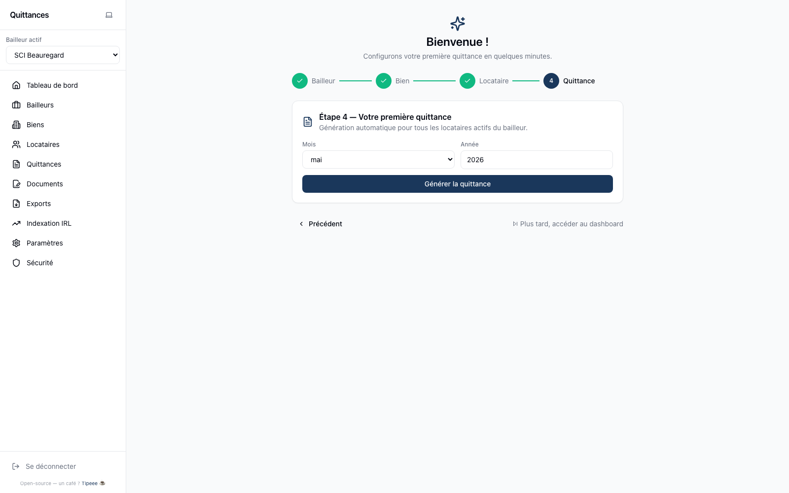

# Guide utilisateur — OpenQuittance

Guide pas-à-pas pour bailleurs non-développeurs. Couvre tout le
cycle d'utilisation : install initial → gestion quotidienne →
clôtures annuelles.

> Captures écran référencées : `docs/screenshots/`. Si un écran ne
> matche pas, c'est probablement que tu es sur une version plus
> récente — l'arbre des menus reste stable.

---

## 1. Première connexion

À la toute première ouverture (`http://localhost:3800` ou domaine
de ton instance), tu tombes sur le **wizard d'install** en 3 étapes
si la base est vierge.

1. **Compte administrateur** — email + mot de passe. Ce compte est
   automatiquement ADMIN sur l'instance entière. Note bien tes
   identifiants, il n'y a pas de récupération possible (auto-
   hébergement, pas de support).
2. **Premier bailleur** — nom commercial, adresse, ville pour
   "Fait à …", couleur PDF. Tu pourras ajouter d'autres bailleurs
   plus tard si tu gères plusieurs entités (SCI multiples, etc.).
3. **C'est prêt !** — un bouton "Aller au dashboard" t'amène à
   l'app. Tu es loggué automatiquement.

Si une instance déjà installée se ré-ouvre sur `/install`, tu es
redirigé vers `/login`.

## 2. Configurer son bailleur

**Menu : Bailleurs → cliquer sur la ligne → Modifier**

Deux onglets :

### Onglet "Infos"

- **Nom commercial** : affiché aux locataires (emails, portail,
  PDFs). Ex. "SCI Beauregard" ou "M. Dupont — Locations".
- **Adresse** : adresse de correspondance.
- **Code postal + ville**.
- **Ville pour "Fait à …"** : ville signature des quittances.
- **Couleur PDF** : teinte d'accent dans les PDFs (logo, titres,
  cadres). Utilise tes couleurs de marque si SCI commerciale.
- **Logo** : PNG / JPG / WebP. Apparaît en en-tête des PDFs.
- **Signature** : PNG transparent recommandé. Apparaît en pied de
  page des quittances (mention "Fait à … le …").
- **Transparence du logo sur signature** : 0-100%. À régler si le
  logo masque la signature manuscrite (essaye 30%).

### Onglet "Légal"

À remplir si tu commercialises (LCEN art. 6 + RGPD art. 13). Pour
usage personnel, tu peux laisser vide — les pages publiques
afficheront « Non renseigné ».

- Raison sociale, forme juridique, SIRET.
- Siège social (si différent de l'adresse de correspondance).
- Email contact RGPD.
- Directeur de publication.
- Hébergeur (par défaut : auto-hébergement).

## 3. Configurer l'email d'envoi

**Menu : Paramètres → Email**

Deux options exclusives :

### Option A — Gmail (OAuth)

Recommandé si tu utilises déjà Gmail.

1. Configure d'abord l'intégration Google OAuth :
   **Menu : Paramètres → Intégrations → Google → Connecter Google**.
   Suit le flow OAuth.
2. Reviens dans Paramètres → Email, sélectionne « Gmail API »,
   enregistre.
3. Les emails partent depuis ton adresse Gmail. Aucun mot de passe
   stocké (OAuth refresh token chiffré en DB).

### Option B — SMTP

Pour serveurs SMTP custom (OVH, Mailgun, SendGrid, etc.).

1. Sélectionne « SMTP ».
2. Host, port (587 ou 465), user, mot de passe (chiffré en DB).
3. Bouton « Tester la connexion » pour valider avant de sauver.

> Sans email configuré, l'app continue de fonctionner — tu peux
> télécharger les quittances et les envoyer par ton canal habituel.
> Mais les workflows d'envoi groupé / portail invitations seront
> bridés.

## 4. Créer un bien

**Menu : Biens → Nouveau logement**

Deux options :

### A. Wizard guidé (recommandé pour démarrer)

4 étapes : infos du bien → type/surface/DPE → locataire actuel
(facultatif) → ajouter d'autres biens.

### B. Ajout simple

Modale Modifier/Créer avec 3 onglets :
- **Infos** : nom interne (ex. "T2 Beauregard"), adresse, CP, ville,
  complément.
- **Documents** (si édition) : upload acte de vente, DPE, diagnostics
  amiante / élec / gaz / plomb / ERP. Les diagnostics légaux
  peuvent être partagés au locataire via flag DDT sur sa fiche.
- **Annonce** (si édition) : rédige une annonce locative
  réutilisable, pré-remplie depuis le locataire actif.

Métadonnées propriétaire (surface, étage, type, DPE classe + kWh
+ GES) : utiles pour les annonces et les rapports.

## 5. Ajouter un locataire

**Menu : Locataires → Ajouter**

### Champs principaux

- **Bien** : sélectionne dans la liste (un bien peut avoir 1
  locataire actif à la fois).
- **Nom + prénom + email + téléphone**.
- **Loyer hors charges + charges** : seront utilisés pour générer
  les quittances mensuelles.
- **Dépôt de garantie** (facultatif).
- **Date d'entrée**, date de sortie (vide si bail en cours).
- **Indexation IRL** : trimestre + valeur de référence à la date
  du bail. Permettra la révision annuelle automatique.

### Partage portail

Cases à cocher : Quittances, État des lieux, Bail, Diagnostics
(DDT). Détermine ce que le locataire verra dans son portail.

### Activer le portail locataire

Clic sur l'icône **UserPlus** (silhouette+) dans la ligne du
locataire → envoie un email d'invitation. Le locataire crée son
mot de passe et accède à `/portail`.

Si email pas configuré côté staff : l'app affiche un **lien
d'activation** à copier-coller (transmettre au locataire par
ton canal habituel).

## 6. Générer la quittance du mois

**Menu : Quittances**

### Génération unitaire

Bouton **« Quittance unitaire »** → choisir locataire, mois, année,
date de paiement, date d'émission, ajustements (avoirs, surplus,
commentaire libre).

### Génération du mois (groupé)

Bouton **« Générer le mois »** → choisir bailleur + mois → l'app
crée une quittance par locataire actif. Doublons ignorés.

### Envoi par email

Sur chaque ligne quittance, plusieurs actions :
- **Aperçu PDF** (icône Eye) : prévisualise le PDF avant envoi.
- **Aperçu email** (icône Send) : montre le mail tel qu'il sera
  envoyé (template + destinataire) avant de cliquer envoyer.
- **Envoyer directement** (icône Mail) : envoi sans aperçu.

### Envoi groupé du mois

Bouton **« Envoyer le mois »** → bulk-send toutes les quittances
non envoyées du mois en cours. Affiche le nombre envoyés / erreurs.

## 7. Inviter un locataire au portail

Cf. section 5 — clic sur **UserPlus**. Le locataire reçoit un email
avec lien d'activation valide 14 jours. Il crée son mot de passe.

Au login locataire, il accède à `/portail/` :
- Mes quittances (téléchargeables)
- Mes documents partagés (bail, EDL, diagnostics si DDT activé)
- Mon profil (email modifiable, mot de passe modifiable)
- 2FA TOTP optionnelle

Pour **désactiver** l'accès : Shift+clic sur l'icône UserCheck
(✓) de sa ligne → confirmation → tous les tokens portail
invalidés.

Pour **renvoyer un lien d'accès** : clic simple sur UserCheck.

## 8. Activer la révision IRL annuelle

L'IRL (Indice de Référence des Loyers) permet la révision
annuelle légale du loyer (loi 89-462 art. 17-1).

**Menu : Indexation IRL**

### A. Configurer l'API INSEE

Première fois uniquement.

1. Crée un compte sur https://api.insee.fr/catalogue/
2. Génère une clé API "Bdm-Series".
3. Colle-la dans Paramètres → IRL → Clé API INSEE → Enregistrer.
4. Bouton « Synchroniser maintenant » → l'app récupère les
   valeurs IRL trimestrielles à partir de 2010.

L'app re-synchronise automatiquement chaque mois en arrière-plan.

### B. Réviser un locataire

Sur la fiche locataire ou via la page IRL :
1. Sélectionne la révision proposée (3, 4, 6 ou 12 mois).
2. Vérifie le calcul : nouveau loyer = ancien loyer × (IRL nouveau
   / IRL référence).
3. Génère un **courrier de révision** PDF (signé + archivé).
4. L'app envoie le courrier au locataire ou tu le télécharges.

Une fois envoyé, la fiche locataire est mise à jour avec le nouveau
loyer + nouveau trimestre IRL de référence.

## 9. Inviter un membre staff

**Menu : Paramètres → Membres**

Disponible uniquement si tu es ADMIN sur le bailleur actif.

1. Bouton **« Ajouter un membre »**.
2. Email du membre, nom (optionnel), **rôle** :
   - **Administrateur** : tout pouvoir, peut gérer les autres
     membres.
   - **Membre** : peut créer/modifier biens, locataires, quittances.
   - **Lecteur** : consultation uniquement.
3. **Bailleurs concernés** : le bailleur actif est forcément
   coché. Coche d'autres bailleurs si tu veux donner accès à
   plusieurs entités au même membre (et que tu es ADMIN sur ces
   autres bailleurs).
4. Si la personne a déjà un compte → ajoutée immédiatement.
   Sinon → reçoit un email d'invitation (ou lien à copier-coller
   si email pas configuré).

## 10. Configurer le backup cloud

**Menu : Backup**

### A. Choisir un fournisseur

- **S3-compatible** : AWS S3, MinIO, Backblaze B2, Wasabi, etc.
- **Google Drive** : nécessite intégration Google OAuth
  préalable.

### B. Configurer

1. Saisir credentials (chiffrés en DB AES-256-GCM).
2. Tester la connexion.
3. **Passphrase de chiffrement** : phrase secrète qui chiffre les
   secrets `.env` AVANT upload cloud. **NE PAS PERDRE** — sans
   elle, les fichiers chiffrés `.env.enc` sont définitivement
   inutilisables.
4. Fréquence (manuelle, quotidienne, hebdomadaire).

### C. Backup contient

- Dump SQL Postgres (toutes les tables).
- Uploads/ chiffrés (uploads bailleur).
- `.env.enc` (secrets app chiffrés avec la passphrase).
- `meta.json` (manifest avec checksums).

### D. Restaurer

Voir [docs/BACKUP.md](BACKUP.md). Téléchargement manuel du `.zip`
depuis le cloud + commande `scripts/restore.mjs`.

## 11. Exporter ses données

**Menu : Exports**

### A. Export ZIP par bailleur

Toutes les données d'un bailleur (bien, locataires, quittances,
documents, archives) dans un ZIP horodaté. Utile pour migration
ou archive long terme.

### B. Export RGPD par locataire

Toutes les données concernant un locataire (ses quittances, son
bail, ses messages, son journal d'audit). Conforme article 20
RGPD (droit à la portabilité). Inclus dans un PDF récapitulatif
+ fichiers joints.

## 12. Gérer les documents propriétaire

Les documents propriétaire (acte d'achat, DPE, diagnostics
amiante, élec, gaz, plomb, ERP, copro, fiscalité…) sont rattachés
au **Bien**.

**Menu : Biens → cliquer sur un bien → onglet Documents**

Upload, suppression, prévisualisation (si PDF/image).

### Partage au locataire (DDT)

Sur la fiche locataire, case **« Partage DDT »** : si cochée, le
locataire voit dans son portail les diagnostics légaux (DPE,
amiante, élec, gaz, plomb, ERP) du bien qu'il loue. Les autres
documents propriétaire restent privés.

## Aller plus loin

- [Architecture technique](ARCHITECTURE.md) — stack, modèle données.
- [Multi-bailleur](MULTI-BAILLEUR.md) — isolation server-side,
  rôles, permissions.
- [Sécurité](SECURITE-CONFORMITE.md) — RGPD, chiffrement,
  conformité.
- [API REST](API.md) — référence pour intégrations futures.
- [FAQ](FAQ.md) — réponses aux questions fréquentes.
- [Glossaire](GLOSSAIRE.md) — termes métier expliqués.

## Support

- Bugs : https://github.com/openquittance/OpenQuittance/issues
- Questions : https://github.com/openquittance/OpenQuittance/discussions
- Contribution : voir [CONTRIBUTING.md](../CONTRIBUTING.md)
